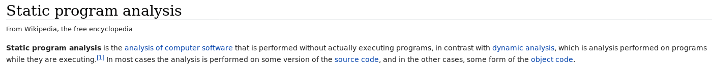

# runme writeup

Dosyanın türüne ```file``` komutu ile baktığımzda karşımıza 64bit bir executable çıkıyor:

```
$ file runme
runme: ELF 64-bit LSB executable, x86-64, version 1 (SYSV), statically linked, stripped
```

Dosyayı çalıştırdığımızda herhangi bir input/output yok. Daha önce belirtildiği üzere, program flagi üretip kapanıyor. Flagi bulmak için iki yöntemden birini kullanmamız gerekecek:

1. Statik analiz
2. Dinamik analiz

[Wikipedia sayfasından:](https://en.wikipedia.org/wiki/Static_program_analysis)



## Statik Analiz

Önce statik analiz yöntemini deneyeceğiz. Assembly kodunu incelemek için dosyayı gdb ile veya herhangi bir disassembler ile açmamız gerekiyor. Şimdilik PEDA plugini yüklü gdb ile yetineceğiz.

```
$ gdb runme
Reading symbols from runme...(no debugging symbols found)...done.
gdb-peda$
```

Programın kodunu incelemek için kodun hangi adreste olduğunu bulmamız gerekiyor. Bunun için ```info file``` komutunu kullanabiliriz:

```
gdb-peda$ info file
Symbols from "/home/erfur/Downloads/siberteknik-rev/runme-writeup/runme".
Local exec file:
	`/home/erfur/Downloads/siberteknik-rev/runme-writeup/runme', file type elf64-x86-64.
	Entry point: 0x401000
	0x0000000000401000 - 0x0000000000401047 is .shellcode
```

Başlangıç adresini öğrendikten sonra bu adresten kodun disassemble edilmiş halini görmek için peda'nın ```pdisass``` komutunu kullanacağız, ancak bu komut kodun tamamını göstermiyor. Kodun hangi adresler arasında olduğunu bulmak için yine peda'nın komutu olan ```elfheader```'ı kullanıyoruz:

```
gdb-peda$ elfheader
.shellcode: 0x401000 - 0x401047 (code)
```

Şimdi bu adresler arasında bulunan tüm verinin kod olduğunu gördüğümüz için bu adresleri ```pdisass``` komutuna veriyoruz:

```
gdb-peda$ pdisass 0x401000 0x401047
Dump of assembler code from 0x401000 to 0x401047::	Dump of assembler code from 0x401000 to 0x401047:
   0x0000000000401000:	mov    rax,0x73
   0x0000000000401007:	push   rax
   0x0000000000401008:	movabs rax,0x6f696b586a5b5d69
   0x0000000000401012:	push   rax
   0x0000000000401013:	movabs rax,0x6a5b62715d57625c
   0x000000000040101d:	push   rax
   0x000000000040101e:	mov    rdx,rsp
   0x0000000000401021:	mov    rcx,0x0
   0x0000000000401028:	cmp    rcx,0x11
   0x000000000040102c:	je     0x40103c
   0x000000000040102e:	mov    al,BYTE PTR [rdx]
   0x0000000000401030:	add    al,0xa
   0x0000000000401032:	mov    BYTE PTR [rdx],al
   0x0000000000401034:	inc    rdx
   0x0000000000401037:	inc    rcx
   0x000000000040103a:	jmp    0x401028
   0x000000000040103c:	mov    rax,0x3c
   0x0000000000401043:	syscall 
   0x0000000000401045:	ret    
   0x0000000000401046:	.byte 0x0
End of assembler dump.
```

Çalışan kodun tamamını listeledik. Kodu satır satır incelemeden önce kodu jump instructionlarına göre kısımlara ayırmak kodun okunabilirliğini artıracaktır.

```
        0x0000000000401000:	mov    rax,0x73
        0x0000000000401007:	push   rax
        0x0000000000401008:	movabs rax,0x6f696b586a5b5d69
        0x0000000000401012:	push   rax
        0x0000000000401013:	movabs rax,0x6a5b62715d57625c
        0x000000000040101d:	push   rax
        0x000000000040101e:	mov    rdx,rsp
        0x0000000000401021:	mov    rcx,0x0
        v
     .->0x0000000000401028:	cmp    rcx,0x11
  .--|--0x000000000040102c:	je     0x40103c
  |  |  0x000000000040102e:	mov    al,BYTE PTR [rdx]
  |  |  0x0000000000401030:	add    al,0xa
  |  |  0x0000000000401032:	mov    BYTE PTR [rdx],al
  |  |  0x0000000000401034:	inc    rdx
  |  |  0x0000000000401037:	inc    rcx
  |  `--0x000000000040103a:	jmp    0x401028
  |     v
  '---->0x000000000040103c:	mov    rax,0x3c
        0x0000000000401043:	syscall 
        0x0000000000401045:	ret    
        0x0000000000401046:	.byte 0x0
```

Kodun başında üç değer register'a yüklenip stacke atılıyor. ```0x401021```e kadar olan kısım çalıştıktan sonra stackimiz aşağıdaki gibi olacak:

```
               0    1    2    3    4    5    6    7
            |----|----|----|----|----|----|----|----|
rdx-> rsp-> | 5c | 62 | 57 | 5d | 71 | 62 | 5b | 6a | 0x6a5b62715d57625c
            |----|----|----|----|----|----|----|----|
            | 69 | 5d | 5b | 6a | 58 | 6b | 69 | 6f | 0x6f696b586a5b5d69
            |----|----|----|----|----|----|----|----|
            | 73 | 00 | 00 | 00 | 00 | 00 | 00 | 00 | 0x73
            |----|----|----|----|----|----|----|----|

```

Daha sonra rspdeki adres rdx'e aktarılıyor. Dolayısıyla rdx de aynı adresi gösteriyor olacak. rcx'i de sıfırladıktan sonra ikinci bloğa geçiş yapıyoruz.


```
     .->0x0000000000401028:	cmp    rcx,0x11
  .--|--0x000000000040102c:	je     0x40103c
  |  |  0x000000000040102e:	mov    al,BYTE PTR [rdx]
  |  |  0x0000000000401030:	add    al,0xa
  |  |  0x0000000000401032:	mov    BYTE PTR [rdx],al
  |  |  0x0000000000401034:	inc    rdx
  |  |  0x0000000000401037:	inc    rcx
  |  `--0x000000000040103a:	jmp    0x401028
  |     v
  '---->0x000000000040103c:	mov    rax,0x3c
```

Bu kısımda önce rcx'teki değer 17 ile karşılaştırılmış. Eğer rcx 17 ise sonraki program sonraki bloktan devam edecek. Eğer değilse rdx'in işaret ettiği adresteki byte al'ye okunup 10 artırılıp aynı adrese geri yazılıyor. rdx ve rcx birer artırıldıktan sonra program bloğun başına geri dönüyor. Bu işlem rcx'in değeri 17 olana kadar devam edecek. Yani stack'e atılan her byte değeri 10 artırılıyor.

```
  '---->0x000000000040103c:	mov    rax,0x3c
        0x0000000000401043:	syscall 
        0x0000000000401045:	ret    
```

Programın son bloğunda ise bir sistem çağrısı var. rax değeri 0x3c olan sistem çağrısı ```exit```. Yani program bu sistem çağrısından sonra kapanacak. (Program ret instruction'ına hiç ulaşmıyor.)

## Dinamik Analiz

Programın ne yaptığını anladığımıza göre aslında flagi kendimiz de çıkarabiliriz ancak program zaten bunu yapmaya *kodlandığı* için programı çalıştırıp bize flagi sunmasını sağlayabiliriz. Bunun için programın son çalıştırdığığ instructionlardan birine breakpoint koyup program çalıştırırsak stackte flag ile karşılaşıyoruz:

```
gdb-peda$ b *0x000000000040103c
Breakpoint 1 at 0x40103c
gdb-peda$ r
Starting program: /home/erfur/Downloads/siberteknik-rev/runme-writeup/runme 
[----------------------------------registers-----------------------------------]
RAX: 0x6a5b62715d57627d ('}bW]qb[j')
RBX: 0x0 
RCX: 0x11 
RDX: 0x7fffffffe009 --> 0x100000000000000 
RSI: 0x0 
RDI: 0x0 
RBP: 0x0 
RSP: 0x7fffffffdff8 ("flag{letsgetbusy}")
RIP: 0x40103c --> 0xf0000003cc0c748 
R8 : 0x0 
R9 : 0x0 
R10: 0x0 
R11: 0x0 
R12: 0x0 
R13: 0x0 
R14: 0x0 
R15: 0x0
EFLAGS: 0x246 (carry PARITY adjust ZERO sign trap INTERRUPT direction overflow)
[-------------------------------------code-------------------------------------]
   0x401034:	inc    rdx
   0x401037:	inc    rcx
   0x40103a:	jmp    0x401028
=> 0x40103c:	mov    rax,0x3c
   0x401043:	syscall 
   0x401045:	ret    
   0x401046:	add    BYTE PTR [rax],al
   0x401048:	cs jae 0x4010b3
[------------------------------------stack-------------------------------------]
0000| 0x7fffffffdff8 ("flag{letsgetbusy}")
0008| 0x7fffffffe000 ("sgetbusy}")
0016| 0x7fffffffe008 --> 0x7d ('}')
0024| 0x7fffffffe010 --> 0x1 
0032| 0x7fffffffe018 --> 0x7fffffffe33a ("/home/erfur/Downloads/siberteknik-rev/runme-writeup/runme")
0040| 0x7fffffffe020 --> 0x0 
0048| 0x7fffffffe028 --> 0x7fffffffe374 ("COLORTERM=truecolor")
0056| 0x7fffffffe030 --> 0x7fffffffe388 ("SESSION_MANAGER=local/n1ghtrid3r:@/tmp/.ICE-unix/1425,unix/n1ghtrid3r:/tmp/.ICE-unix/1425")
[------------------------------------------------------------------------------]
Legend: code, data, rodata, value

Breakpoint 1, 0x000000000040103c in ?? ()
```

Flagimiz ```flag{letsgetbusy}```